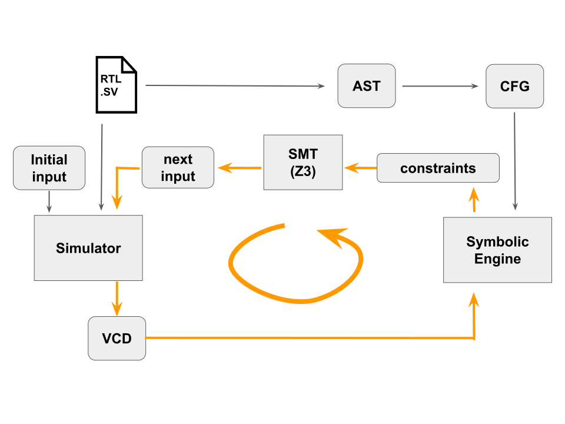

# SystemVerilog 用の自動テストケース生成ツール

SystemVerilog を対象に Concolic Testing を行うプロトタイプです。
シミュレータによる実行と、シンボリック実行を交互に繰り返すことで SystemVerilog で記述された回路に対するラインカバレッジ100%のテストケースを生成します（DART[1]やHYBRO[2]などと同様）。

現状では、サポートしている SystemVerilog の機能と性能に制限があります。

**Disclaimer: PFN provides no warranty or support for this software. Use it at your own risk.**

このソフトウェアは[PFN2018 夏季インターン](https://www.preferred-networks.jp/ja/news/internship2018summer_jp)の一環として、主に押川広樹さんによって開発されました。

## 実行方法

### 依存

* OCaml (>= 4.05.0)
  * dune (>= 1.0.1)
  * z3 (>= 4.7.1)
  * ocamlgraph (>= 1.8.8)
  * ppx_deriving (>= 4.2.1)
* [Z3](https://github.com/Z3Prover/z3) (>= 4.7.1)
* [menhir](http://gallium.inria.fr/~fpottier/menhir/) (>= 20180703)
* SystemVerilog Simulator

OCamlの ライブラリと menhir は [opam](https://opam.ocaml.org/) からインストール出来ます。

### ビルド & 実行

```sh
make
_build/default/src/main.exe -i file.sv -f file.bin -v log.vcd -s script.sh
```

現状では、パーサの warning が大量に出ます。

* `file.sv` : 対象の SystemVerilog プログラム
* `file.bin` : 実行中に回路の入力ベクトルを読み書きするためのファイル
* `log.vcd` : シミュレーション結果が出力される VCD ファイル
* `script.sh` : シミュレーションを実行するシェルスクリプト。`file.sv` の回路を `file.bin` の入力に対して実行し、結果を `log.vcd` として出力することが必要。

#### オプション

```txt
-c              dump coverage information
-dparse         dump parsed tree
-dir            dump IR
-dcfg           generate dot files from CFG
-dtrace         dump trace
-dz3            dump z3 log
-dinputs file   dump all input vectors to [file]
-test           run without concrete execution
```

## 動作原理

1. ソースコードを解析して Control Flow Graph(CFG) を生成
2. シミュレーションのためにランダムな入力ベクトルを生成
3. シミュレーションを実行
4. VCD を元に CFG のどのパスが実行されたかを計算
5. 実行されていない部分を実行するのに必要な制約をシンボリックに求める
6. SMT ソルバーを用いて制約を解く
7. 得られた解から入力に関わる部分を取り出して、次の入力とする
8. 全ての部分が実行されるまで 3-7 を繰り返す

上の過程で得られた入力ベクトルがテストケースとなる。



## src/ のファイル構成

* lexer.mll:     レキサー
* parser.mly:    パーサー
* parsetree.ml:  パース後の抽象構文木
* ir.ml:         簡潔な内部表現と抽象構文木からの変換
* cfg.ml:        CFG と 内部表現からの変換
* vis.ml:        CFG の可視化のための関数
* ce.ml:         VCD と CFG から実行されたパスを計算
* constraint.ml: まだカバーされていない CFG のパスをたどるために必要な制約を計算
* solve.ml:      Z3 を用いて制約を解消
* main.ml:       全体をくっつける

## ライセンス

MITライセンス（詳細は [LICENSE](./LICENSE) ファイルを参照）。

## 参考文献

* [1] P. Godefroid, N. Klarlund, and K. Sen, DART: Directed Automated Random Testing. In Proceedings of the 2005 ACM SIGPLAN conference on Programming language design and implementation (PLDI'05), 2005.
* [2] L. Liu and S. Vasudevan, Efficient validation input generation in RTL by hybridized source code analysis, In Proceedings of the 2011 Design, Automation & Test in Europe, Grenoble, 2011.